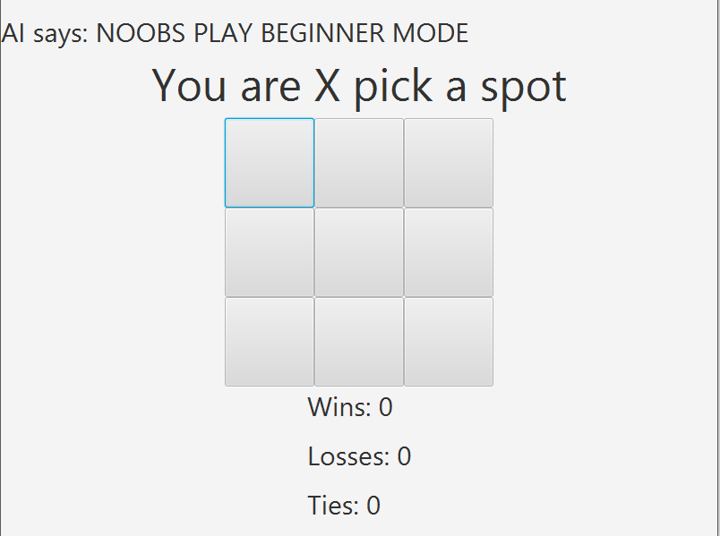
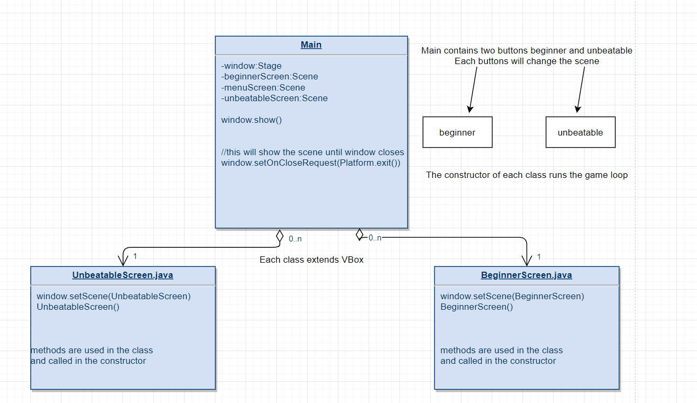

# Wargames
This is a project to practice object oriented programming with java and put it to use.

The project consists of a tic-tac-toe game. The player must defeat the ai in order to win.

There are two difficulties beginner and unbeatable.

# Description:

Two buttons are available for each type of game mode. Unbeatable and Beginner.

The unbeatable mode is tic-tac-toe but unbeatable. Beginner is tic-tac-toe but an easy version.

I have included the following features:

1. Animations for win, lose, draw.
2. Beginner difficutly.
4. Game Tracker for win lose and tie
5. Trash Talk Dialogue.

# Installation:
The project can be run through any IDE that supports java. If the project is exported, it must be exported as a .jar file because of the classes.

# Technologies:
The Wargames software is a Java only program.

The graphics and animations for the software are made with JavaFX.

# Screenshot

 
 # Flow Diagram
 
 
